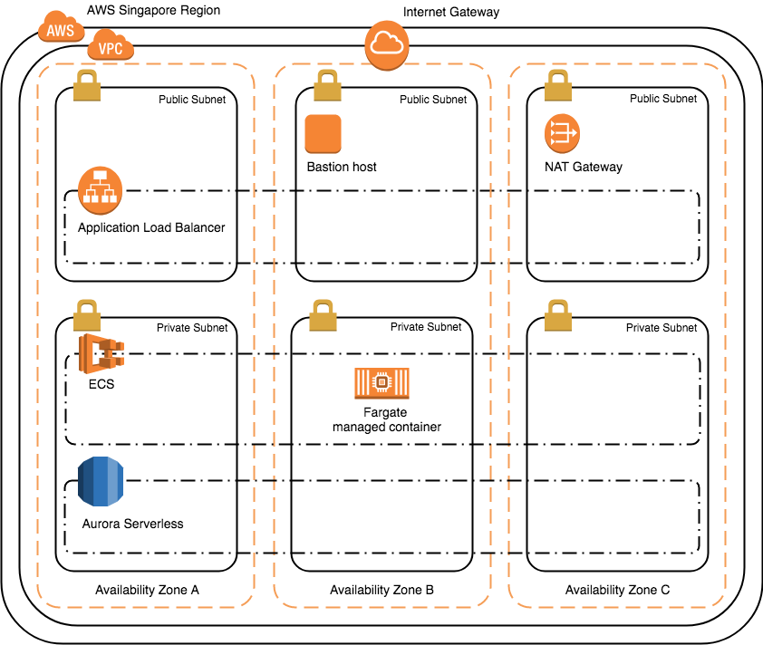

# DevOps BKK 2018 Demo

This demo demonstrates how to use Terraform to provision the infrastructure and run [Ghost](https://ghost.org/) application on AWS by using several AWS services including [VPC networking](https://aws.amazon.com/vpc/), [Application Load Balancer (ALB)](https://docs.aws.amazon.com/elasticloadbalancing/latest/application/introduction.html), [Elastic Container Service (ECS)](https://aws.amazon.com/ecs/), [Fargate](https://aws.amazon.com/fargate/) and [Aurora Serverless](https://aws.amazon.com/rds/aurora/serverless/).



## Instructions

You can run this solution in any regions that Fargate and Aurora Serverless are available by adjusting the variable values on `0-main.tf` (Singapore region is used by default).

You can do it step-by-step either by checking out each individual commit from Git history or comment/uncomment `2-alb-aurora-serverless.tf` and `3-ecs-fargate.tf` files before start. Or you could do everything in one goal by running `terraform init`, `terraform plan` and then `terraform apply`.

### Step 1: VPC Networking (~ 2.30 min)
Create key pair with the same name as `name` variable on `0-main.tf` with and run:
```
terraform init
terraform plan
terraform apply
```

### Step 2: ALB and Aurora Serverless (~ 3 min)
Run:
```
terraform get
terraform plan -no-color | grep '+\s\|-\s\|~\s'
terraform apply -auto-approve
```
To SSH tunnel to the database, run:
```
ssh-add <path to the key pair pem file>
<use aurora_ssh_tunnel output from terraform apply>
```

### Step 3: ECS and Fargate (~ 2.30 min)
Uncomment step 3 section on `main.tf` and run:
```
terraform plan -no-color | grep '+\s\|-\s\|~\s'
terraform apply -auto-approve
```

### Step 4: Cleanup
Run:
```
terraform destroy
```
Then, delete the key pair.
